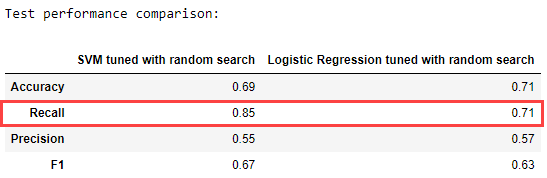
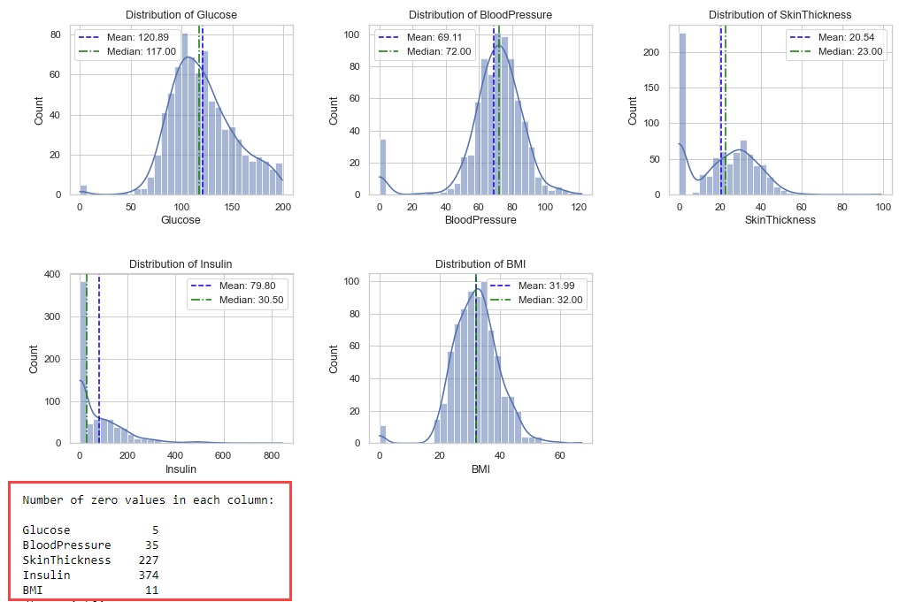
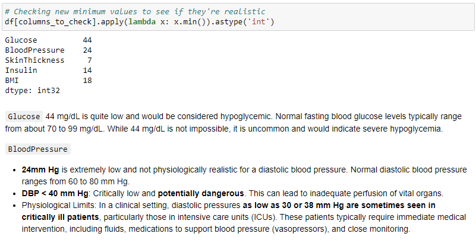

# Diabetes Classification
This dataset is originally from the National Institute of Diabetes and Digestive and Kidney Diseases, and for this specific project was pulled from [kaggle](https://www.kaggle.com/datasets/uciml/pima-indians-diabetes-database/data). The objective of the dataset is to diagnostically predict whether or not a patient has diabetes, based on certain diagnostic measurements included in the dataset. Several constraints were placed on the selection of these instances from a larger database. In particular, all patients here are females at least 21 years old of Pima Indian heritage.

## Overview
The primary objective is to leverage this data to build a predictive model that predicts whether a patient has diabetes.

## Setup and Installation
1. Clone this repository to your local machine.
2. Ensure you have Python installed.
3. Install the required libraries using the following command:
pip install -r requirements.txt

## Model and Data 
The best performing model is SVM, followed by Logistic Regression.

### Preprocessing
Many zero values were imputed with mean or median

Following imputation, there were still a few alarming values for several patients who have either extremely low blood glucose levels and/or dangerously low blood pressure, with one instance being unrealistic: 

### Training 
The model was trained with a suite of five classification algorithms: LogisticRegression, LinearDiscriminantAnalysis, SVM, RandomForestClassifier, and GradientBoostingClassifier. 

## Contributing
Contributinos to this project are welcome. Please fork the repository and submit a pull request with your changes.

## License
This project is open source and available under the MIT License.

